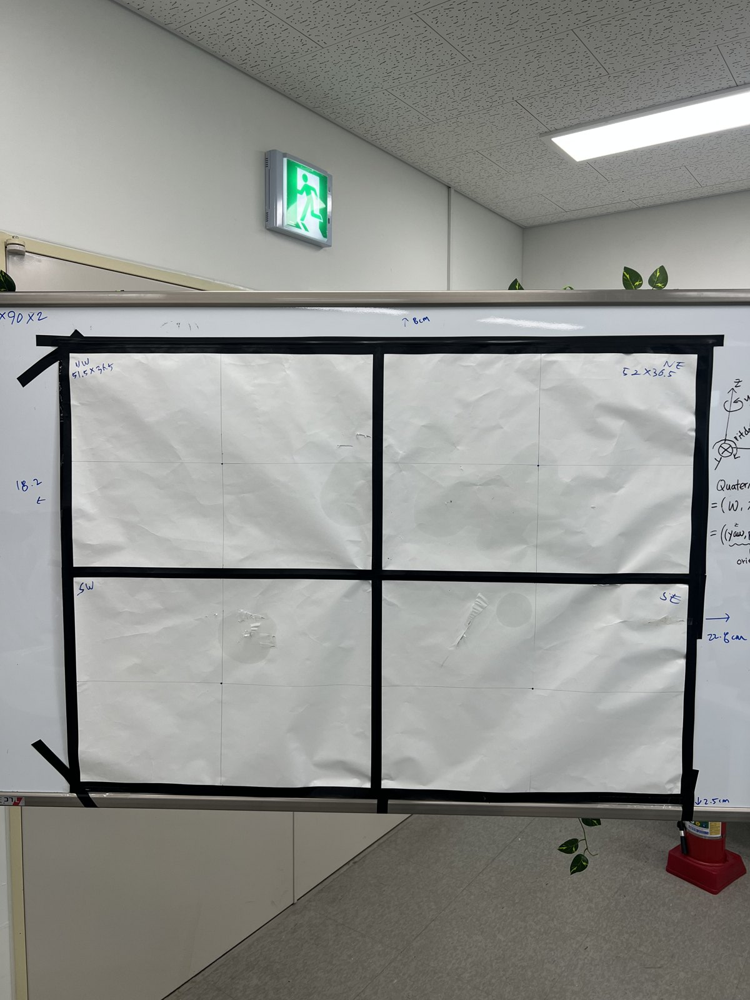
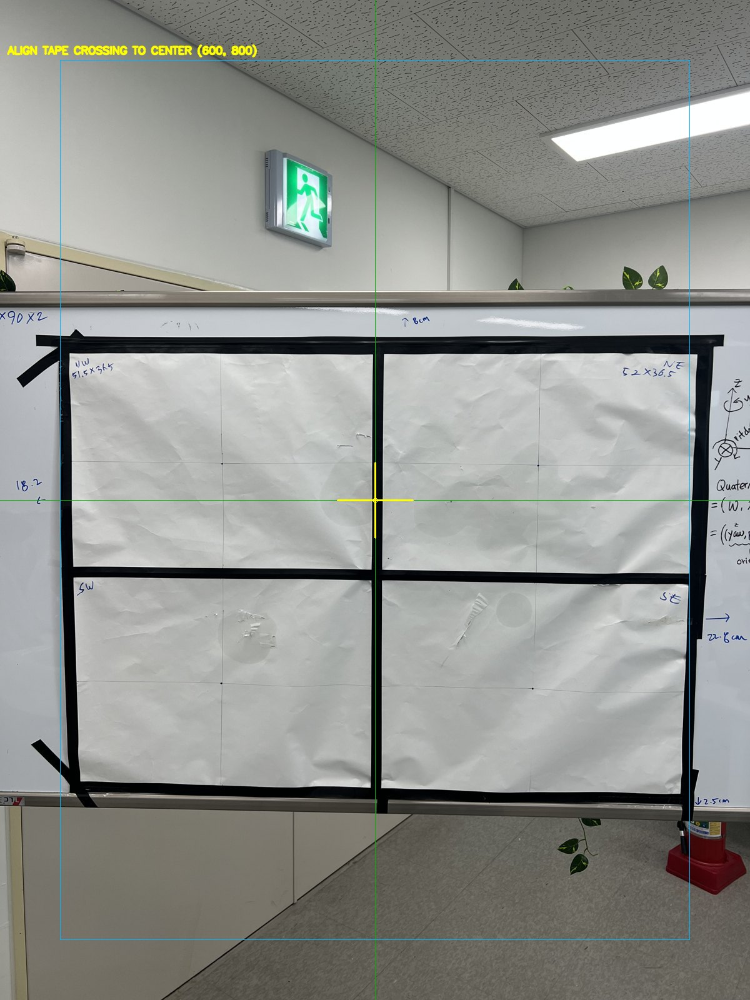
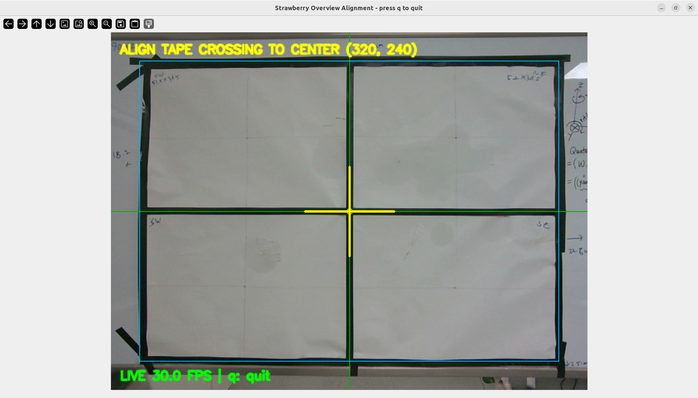
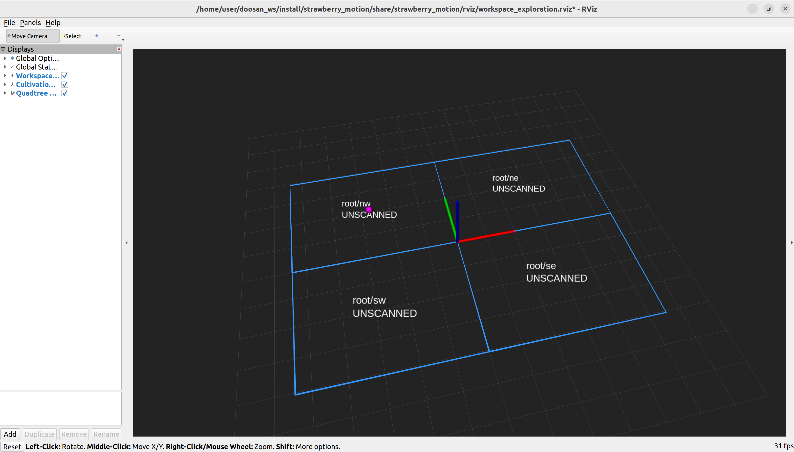

# 포트폴리오 및 자기소개서 Evidence Bank

## 작성 원칙

- 구현 또는 검증된 사실만 `확보한 근거`에 기록합니다.
- 앞으로 할 기능은 `계획`으로 분리합니다.
- 각 claim에는 가능한 경우 run, issue, commit을 연결합니다.

## 프로젝트 역할

본인은 실제에 가까운 딸기 수확 프로젝트에서 **전체 수확 motion system**을
담당합니다. 범위는 작업영역 탐색을 위한 scan motion, target 검증,
approach/grasp/retreat/transfer/place sequence, planner/executor 통합,
collision/retry 대응과 성능 평가입니다.

팀원은 복잡 환경에서 VLA 기반 수확 판단을 담당하며, VLA의 high-level
proposal은 모션 시스템의 geometry/collision 검증을 통과한 뒤 실행하도록
역할 경계를 정의했습니다.

## 현재까지 확보한 근거

### 1. 미니프로젝트 결과를 최종 프로젝트의 baseline으로 분리

- 기존 `RealSense + YOLO + cuRobo + Doosan E0509` 기반 pick & place
  prototype 결과를 별도 저장소에 보존했습니다.
- 최종 프로젝트는 기존 코드를 무작정 복제하지 않고, 안정된 부분을
  모듈화하여 선별 이식하는 전략으로 시작했습니다.

근거:

- baseline: https://github.com/djdoss1234/strawberry_miniproject
- final project 초기 문서: commit `2f7a5d0`, `8a6b048`

### 2. Quadtree 기반 작업영역 탐색 구조를 첫 구현으로 선정

- 본인의 motion 담당 범위에 맞춰 `어디를 관찰할지`를 관리하는 exploration
  layer를 먼저 구축하기로 결정했습니다.
- VLA는 `무엇을 수확할지` 판단하고, motion layer는 `어디를 보고 실제로
  실행 가능한지`를 담당하도록 역할을 분리했습니다.

근거:

- 개발 방향 결정: commit `7d98045`
- roadmap: `docs/development_roadmap.md`

### 3. Exploration Core와 ROS Visualization Interface 구현

- workspace를 quadtree cell로 분할하고 상태를 관리하는 pure Python core를 구현했습니다.
- ROS 2 visualization node를 추가해 workspace cell과 다음 관찰 cell을
  topic으로 노출했습니다.
- cell 상태 update 후 다음 관찰 대상이 전환되는 흐름을 실행 검증했습니다.

근거:

- implementation: commit `762865b`, `a95ca8e`
- execution record: `RUN-20260526-001`
- verified topics:
  - `/strawberry/exploration/workspace_cells`
  - `/strawberry/exploration/next_cell`
  - `/strawberry/exploration/set_cell_state`
- unit tests: 10개 통과

대표 시각자료 배치 예정 위치:

<!-- VISUAL TODO
asset_id: RUN-20260526-001_rviz_quadtree_cells
capture: quadtree cell 상태와 다음 관찰 cell이 표시된 RViz 화면
source_path: artifacts/RUN-20260526-001/raw/rviz_full.png
public_path: docs/assets/exploration/RUN-20260526-001_rviz_quadtree_cells.png
use_in: 포트폴리오 탐색 모듈 섹션, GitHub README, Notion Evidence Bank
status: NOT_CAPTURED
-->

### 4. 물리 Workspace 실측과 Frame 기준 정의

- 화이트보드 내부 종이 4분할 영역을 실제 quadtree workspace로 사용하기
  위해 치수를 측정했습니다.
- 테이프 교차점을 `cultivation_panel` 원점과 root split으로 정의하고,
  비대칭 outer bounds를 config에 반영했습니다.
- 종이 네 장을 절연테이프로 결합하고 외곽을 보드에 부착한 구조상,
  outer bounds와 usable paper cell 치수 차이가 생길 수 있음을 확인했습니다.
- 약 `20 mm` tape band와 물리 workspace 사진을 확보했습니다. 방향별
  band 3개의 약 `60 mm` 점유폭은 cell/outer 치수 차이 `65/70 mm`를
  설명하는 근거가 됩니다.
- 이 값은 정밀 motion safety margin이 아닌 dead-zone 해석 근거로
  제한해 기록했습니다.

근거:

- testbed record: `docs/testbed_setup.md`
- run: `RUN-20260526-002`
- issue: `ISSUE-20260526-003`
- config: `config/workspace.yaml`

### 5. 구현 중 발견한 문제를 실기 연결 전에 해결

- scan 순서가 문자열 정렬에 흔들릴 가능성과 ROS node 종료 traceback을
  최초 topic 점검 단계에서 발견했습니다.
- scan order를 결정적으로 보장하고 shutdown 조건을 정리한 뒤 다시
  실행 검증했습니다.

근거:

- issue: `ISSUE-20260526-001`
- related commit: `a95ca8e`

수정 결과를 보여줄 자료 배치 예정 위치:

<!-- VISUAL TODO
asset_id: RUN-20260526-001_next_cell_transition
capture: root/nw 상태 갱신 전후 next cell 전환이 확인되는 화면
source_path: artifacts/RUN-20260526-001/raw/state_transition.png
public_path: docs/assets/exploration/RUN-20260526-001_next_cell_transition.png
use_in: 포트폴리오 문제 해결 카드, 자기소개서 첨부 자료, Notion Issue page
status: NOT_CAPTURED
-->

### 6. 물리 Workspace와 Camera 중심 정렬 보조 기능 구현

- 종이 workspace 중앙 테이프 교차점을 camera 중심에 맞추기 위한
  `camera_alignment_node`를 구현했습니다.
- 화면 중앙 axes/crosshair와 여백 guide를 overlay image로 publish해,
  overview pose 확보 과정을 육안으로 반복 가능하게 만들었습니다.
- dependency 확인 중 발견한 `cv_bridge`와 `NumPy 2.x` compatibility
  문제를 피해, `sensor_msgs/Image` buffer를 직접 처리하도록 구현했습니다.
- synthetic ROS image 입력으로 overlay output의 `bgr8` publish와
  중앙 crosshair pixel 생성을 검증했습니다.
- 실제 조그 정렬에는 ROS image relay 경로가 끊긴다는 사용성 문제를
  확인하여, `pyrealsense2` direct capture 기반 저지연 viewer로
  현장 도구의 역할을 분리했습니다.

근거:

- run: `RUN-20260526-003`
- issue: `ISSUE-20260526-004`, `ISSUE-20260526-005`
- 전체 unit tests: `14개` 통과
- ROS transport 검증: synthetic image input -> overlay image output 확인

위 이미지는 renderer 설명용 preview이며, 실제 robot camera 정렬 결과는
아래 physical overview 정렬에서 별도로 확보했습니다.

### 6.1 실제 Overview Camera Pose 정렬

- camera viewer는 화면 표시만 담당하고, Doosan DART 수동 joint 조작으로
  실제 종이판 중앙 테이프 교차점을 십자선 중심에 맞췄습니다.
- 화면에서 네 cell 전체와 중앙 경계가 식별되고, direct viewer
  `LIVE 30.0 FPS` 표시를 확인했습니다.
- 정렬 순간의 joint position과 TCP pose를 `config/recorded_poses.yaml`에
  저장해 다음 RViz/scan pose 단계의 재현 기준으로 사용합니다.
- TCP pose는 기준 자세 기록이며, workspace-to-base transform은 후속
  frame 검증에서 별도로 결정합니다.

### 7. 실기 Safety Incident와 Motion Validation 경계 재정의

- 카메라 십자선 정렬을 위해 joint를 개별 조작하는 방식은 화면상의
  이동 방향이 직관적이지 않아 현장 사용성이 낮았습니다.
- 이를 개선하려 direct viewer에 Doosan `MoveLine` relative translation을
  연결했지만, joint-limit, IK branch, collision 선검증 없이 실제 motion을
  호출할 수 있는 설계 오류가 있었습니다.
- 실기 실행에서 joint limit 충돌로 로봇이 정지/꺼지는 사고가 발생했고,
  해당 기능을 즉시 철회했습니다.
- viewer는 camera 표시 전용으로 제한하고, 이전 motion 옵션을 다시
  사용해도 실행을 거부하도록 fail-closed 처리했습니다.
- 앞으로 수동 UI나 scan motion도 planner 또는 동일 수준의 safety
  validation을 통과하기 전에는 실제 실행기에 연결하지 않습니다.

근거:

- withdrawn run: `RUN-20260526-004`
- critical issue: `ISSUE-20260526-006`
- mitigation: motion service 호출 제거, unsafe option 거부 test 포함

### 8. Scan Pose Preview에서 실행 전 시각화 오류 발견

- registered panel 위에 cell별 camera observation pose preview를 표시하는
  단계에서, arrow가 cell에서 camera 후보 위치로 향해 실제 시선 방향과
  반대로 읽히는 문제를 확인했습니다.
- robot motion에 연결하기 전에 marker 의미를 수정하여, camera 후보
  위치에서 cell center를 향하는 방향으로 표시하도록 정리했습니다.
- 수정 후 RViz에서 네 camera 후보 위치와 cell 방향 표시를 다시 확인했습니다.

근거:

- evidence: `docs/assets/exploration/RUN-20260527-003_scan_pose_preview_direction_issue.png`
- corrected evidence: `docs/assets/exploration/RUN-20260527-003_scan_pose_preview_corrected.png`
- status: visualization correction before motion integration

### 12. Registered Whiteboard Collision Dry-run으로 Scan 후보 검증 범위 확장

- `v6` scan pose 네 개를 단순 IK/empty-world 조건에서 끝내지 않고,
  미니프로젝트에서 사용하던 robot/tool collision sphere와 현재
  `panel_registration`에서 생성한 whiteboard cuboid를 함께 넣어
  offline cuRobo planning으로 재검증했습니다.
- 결과는 네 cell 모두 `PLAN_VALID`였습니다.
- 단, `SW`는 `J1=203.77 deg`, `J5=124.70 deg`, `SE`는
  `J6=-223.67 deg`까지 사용하여 joint-limit margin이 작음을 확인했습니다.
- self-collision, table/tray, cable, human obstacle, panel TF 오차는 아직
  포함하지 않았으므로 이 결과를 실제 자동 motion 승인으로 사용하지 않고
  `use_for_automated_motion: false`를 유지했습니다.

근거:

- world config: `config/scan_collision_world.yaml`
- validator: `scripts/validate_v6_collision_scan_poses.py`
- result: `docs/runs/RUN-20260527-007_registered_whiteboard_collision_dryrun.yaml`
- status: registered-whiteboard collision dry-run complete; physical execution locked

### 11. VLA ↔ Motion Layer 인터페이스 설계 및 구현

- VLA가 수확 target을 제안할 때 motion layer가 실제 실행 없이 검증하는
  structured interface를 구현했습니다.
- `ApproachProposal` dataclass로 VLA 제안(cell_id, direction, confidence)을
  수신하고, `validate_approach_proposal()`이 robot motion 없이
  `MotionValidationResult`를 반환합니다.
- RECOVER_HOME 제안은 VLA/rule layer가 보낼 수 있지만, 현재 경로 검증
  전에는 `NOT_VALIDATED`로 반환되어 실행되지 않습니다.
- offline lookup table에 frame 오류를 수정한 `v6` dry-run 결과를 반영했고,
  네 cell 모두 검증 범위 내 `VALID`입니다. 다만 offline `VALID`는
  physical motion authorization과 분리되어 `is_executable=False`입니다.
- fail-closed motion gate를 포함한 전체 단위 테스트 `46개` 통과.

근거:

- interface: `src/strawberry_motion/interfaces/approach_proposal.py`
- tests: `tests/test_approach_proposal.py`, `tests/test_scan_safety.py`,
  `tests/test_scan_collision_world.py`
- status: implemented and unit-tested; runtime collision-aware authorization은 미구현

### 10. cuRobo Offline IK/Motion 검증으로 실행 가능한 cell과 불가능한 cell 식별

- GPU가 정상 노출된 환경에서 geometry-only TCP candidate 네 개를 cuRobo
  `MotionGen.plan_single`로 dry-run 검증했습니다.
- 실행 없이 cell별 도달 가능 여부를 미리 판단해, 안전하지 않은 pose를
  실제 robot 실행 전에 필터링했습니다.
- 이 초기 검증 결과는 NE/SE = PLAN_VALID, NW/SW = IK_FAIL이었으며,
  이후 ee link orientation 오류를 수정한 `v6` 후보로 대체되었습니다.
  - NW/SW는 panel 왼쪽 x ≈ -0.41m 위치가 현재 orientation 조건에서 E0509 workspace 밖
  - NE/SE는 x ≈ 0.12m 위치로 도달 가능 및 충돌 없는 경로 생성 확인

근거:

- script: `scripts/validate_scan_poses.py`
- result: `docs/runs/RUN-20260527-004_curobo_dry_run.yaml`
- status: historical baseline; current 기준은 section 12의 `v6` 결과

### 9. Observation Pose를 TCP 후보로 변환하고 실행 전 검증 경계 유지

- 네 cell의 camera observation 후보를 기존 eye-in-hand calibration을
  이용해 TCP target transform으로 변환하는 exporter를 구현했습니다.
- 후보는 geometry-only config로 저장하고 `use_for_automated_motion: false`
  상태를 유지했습니다.
- cuRobo dry-run을 시도하기 전 환경을 점검한 결과 CUDA device가 노출되지
  않아, IK/collision 결과는 아직 주장하지 않고 blocker로 기록했습니다.

근거:

- candidate config: `config/scan_pose_candidates.yaml`
- exporter: `src/strawberry_motion/exploration/scan_pose_target_exporter.py`

## 아직 하지 않은 것

- RViz 화면에서 cell marker 표시 캡처
- `v6` camera observation pose의 collision-aware 후보 검증 이후 실기 실행
- robot scan motion 실행
- detector 결과를 cell 상태에 반영
- tray marker localization 및 자동 place
- planner 비교와 collision/retry 고도화
- 팀원의 VLA module 연동

## 단계별로 확보할 대표 시각자료

| 단계 | 자료 | 상태 | 배치 위치 |
| --- | --- | --- | --- |
| Quadtree visualization | RViz cell/next marker 방향 검증 캡처 | `CAPTURED` | `docs/assets/exploration/RUN-20260527-001_rviz_cells.png` |
| Quadtree ROS 연결 | `rqt_graph` 캡처 | `NOT_CAPTURED` | `docs/assets/exploration/` |
| Physical workspace 정렬 | 종이 4분할과 overview camera 정렬 화면 확보 | `CAPTURED` | `docs/assets/exploration/RUN-20260526-002_overview_camera.png` |
| Camera 중심 정렬 보조 | direct viewer 표시 및 `30.0 FPS` 실기 확인 | `CAPTURED` | `docs/assets/exploration/RUN-20260526-002_overview_camera.png` |
| Cartesian step alignment | joint-limit 사고 후 철회, safety guard 재설계 필요 | `WITHDRAWN` | `docs/issues/ISSUE-20260526-006_cartesian_step_without_joint_limit_guard.md` |
| Scan pose 생성 | cell별 camera pose preview 방향 수정 및 RViz 확인 | `PREVIEW_VALIDATED` | `docs/assets/exploration/RUN-20260527-003_scan_pose_preview_corrected.png` |
| Robot scan motion | 실제 로봇 관찰 순회 영상 | `NOT_STARTED` | 공개 clip 결정 후 `docs/assets/motion/` 또는 외부 링크 |
| Tray 자동 place | tray 이동 전후 place 영상 | `NOT_STARTED` | `docs/assets/tray/` 또는 외부 링크 |
| Planner/collision 개선 | 수정 전후 비교 그림/영상 | `NOT_STARTED` | `docs/assets/motion/` |
| VLA 통합 | proposal-to-result graph/demo | `NOT_STARTED` | `docs/assets/integration/` |
| 최종 결과 | 전체 demo 영상과 지표표 | `NOT_STARTED` | `docs/assets/results/` 및 README |

## 자소서/면접 문장 초안

> 미니프로젝트에서 카메라에 보이는 딸기를 pick & place하는 pipeline을
> 구현한 뒤, 최종 프로젝트에서는 실제 농장형 환경을 고려해 작업영역
> 탐색부터 모듈화했습니다. 저는 quadtree 기반 workspace state map과
> ROS visualization interface를 구현하여, 관찰이 필요한 영역과 재방문
> 대상 영역을 motion system이 관리할 수 있는 기반을 만들었습니다.
> 초기 실행 과정에서는 scan 순서의 비결정성과 node 종료 오류를 발견해
> unit test와 topic 검증으로 수정했으며, 이후 실제 camera scan motion,
> tray 자동 place, VLA 연동으로 확장할 계획입니다.

이 문장은 현재 검증 범위까지만 반영한 초안이며, robot motion과 실제
반복 실험 결과가 확보되면 수치 중심으로 갱신합니다.
